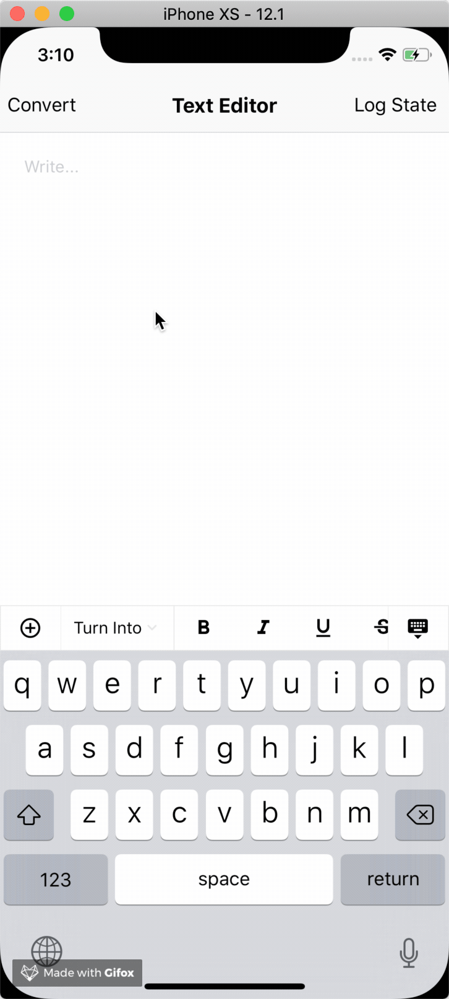

# React Native WYSIWYG

Rich text editor for React Native

Supports Draft.js and Markdown

### To Do

- [x] Convert from Draft.js contentState
- [x] Convert to Draft.js contentState
- [ ] Convert from Markdown
- [x] Convert to Markdown
- [x] Bold
- [x] Italic
- [x] Underline
- [x] Strikethrough
- [x] Move line up & down
- [x] Bullets (Unordered List)
- [x] Numbered List (Ordered List)
- [x] Blockquote
- [x] Heading 1
- [x] Heading 2
- [x] Heading 3
- [ ] Font colors
- [ ] Tables
- [ ] Insert images
- [ ] Intends
